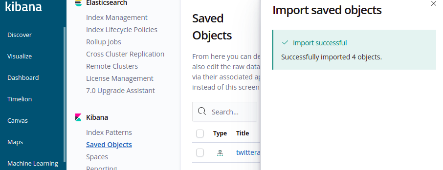
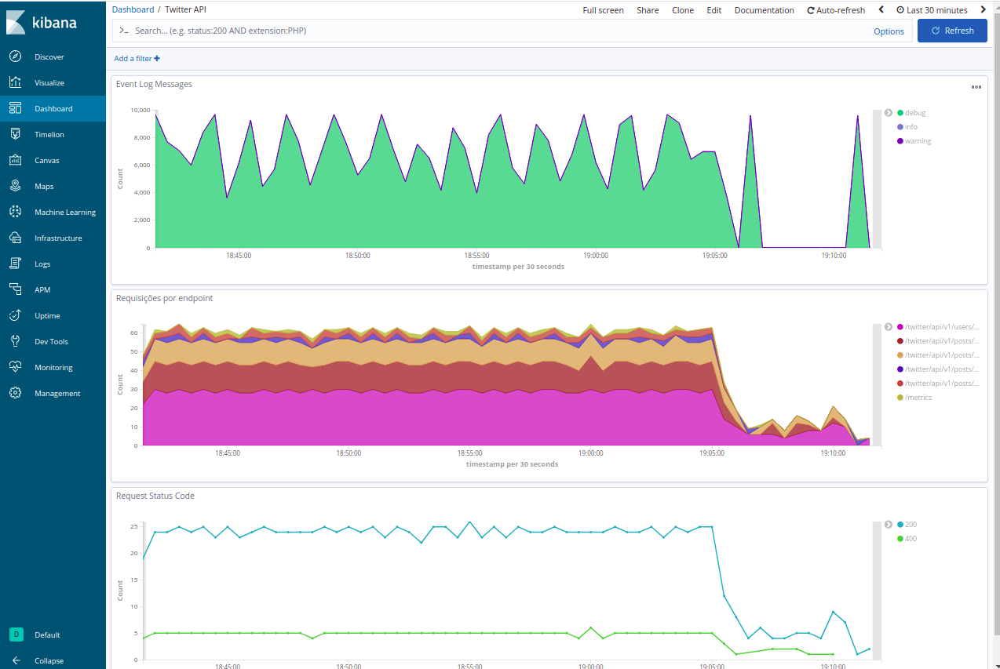

# MyTwitterApi

> MyTwitterApi é um case de exemplo de uma aplicação onde são implementados os três pilares da Observabilidade: Logs, Métricas e Eventos.

 [](https://www.python.org/) [](https://lbesson.mit-license.org/)

# Conteúdo
=================
<!--ts-->
   * [Ambientes](#Ambientes)
      * [Aplicação](#Aplicação)
         * [twrestapi](#twrestapi)
         * [twitterctl](#twitterctl)
      * [Database](#database)
      * [Logs](#logs)
      * [Métricas](#métricas)
      * [Pré-Requisitos](#Pré-Requisitos)
      * [Deploy dos Ambientes](#deploy-dos-ambientes)
      * [Acessando os serviços](#acessando-os-servi%C3%A7os)
      * [Publicando dados na API](#publicando-dados-na-api)
      * [Consumindo dados da API](#consumindo-dados-da-api)
      * [Logs e Métricas](#logs-e-m%C3%A9tricas)
          * [Dashboard de logs no Kibana](#logs-e-m%C3%A9tricas)
            * [Criar Index Pattern](#criar-index-pattern)
            * [Importação de Dashboard](#importa%C3%A7%C3%A3o-de-dashboard)
            * [Rastreamento de log de requisições pelo uuid](#rastreamento-de-log-de-requisi%C3%A7%C3%B5es-pelo-uuid)
          * [Dashboard de métricas no Grafana](#dashboard-de-m%C3%A9tricas-no-grafana)   
      * [Autor](#autor)
<!--te-->

# Ambientes

Todos os ambientes são executados em [containers](https://www.docker.com/resources/what-container) no Docker. 


Os arquivos do projeto estão estruturados da seguinte forma:

    mytwitterapi
    ├── infralogs                   # Arquivos de configuração do ambiente de logs
    ├── inframetrics                # Arquivos de configuração do ambiente de métricas
    ├── exports                     # Arquivo de coleção do Postman e Dashboard do kibana para importação
    ├── twitterctl                  # Client de linha de comando twitterctl.py
    ├── twrestapi                   # Código fonte da api
    ├── docker-compose.yml          # Arquivo do Compose para deploy dos containers 
    ├── LICENSE
    └── README.md

## Aplicação

### twrestapi

Api Rest para publicação e consulta de posts do Twitter:

- [x] Publicação de posts do twitter
- [x] Listagem de usuários com mais seguidores
- [x] Contagem de posts publicados por hora do dia
- [x] Contagem de posts publicados de um usuário de acordo com uma determinada tag agrupados por localização ou linguagem

Tecnologias:

* [Flask](https://flask.palletsprojects.com/en/1.1.x/): Framework para desenvolvimento web.
* [mongoengine](http://mongoengine.org/): Object-Document Mapper para MongoDB.

### twitterctl

Client de linha de comando para busca de posts no Twitter e publicação na twrestapi:

- [x] Busca de posts no twitter a partir de um conjunto de tags especificos
- [x] Publicação de posts do twitter na twresapi

Tecnologias:

* [Fire](https://github.com/google/python-fire): biblioteca para gerar CLI's a partir de qualquer objeto Python.

## Database

A aplicação utiliza o banco de dados NoSQL [MongoDB](https://www.mongodb.com/1).

## Logs

Ambiente de logs executando:

* [Elasticsearch](https://www.elastic.co/pt/elasticsearch/) para armazenamento e indexação dos logs da aplicação.
* [Kibana](https://www.elastic.co/pt/kibana) para visualização e analise dos logs.
* [Vector](https://vector.dev/docs/about/what-is-vector/) para envio dos logs da aplicação para o Elasticsearch.


## Métricas

* [Prometheus](https://prometheus.io/) para coleta e armazenamento de métricas.
* [Grafana](https://grafana.com/) para visualização e analise de métricas.

# Pré-Requisitos

Você pode executar esses ambientes em qualquer sistema operacional com suporte a docker mas não posso garantir que tudo vai funcionar como esperado portando recomendo testar seguindo os requisitos abaixo:

* Sistema Operacional: Ubuntu 18 LTS 
* Memória RAM: >= 6GB


# Deploy dos Ambientes

Antes de começar a executar o ambiente, você vai precisar ter instalado em sua máquina as seguintes ferramentas:

* [Git](https://git-scm.com)
* [Docker](https://docs.docker.com/engine/install/ubuntu/)
* [Docker-Compose](https://docs.docker.com/compose/install/)


```bash
# Clone este repositório
$ git clone https://github.com/ezequielsbarros/mytwitterapi.git

# Acesse a pasta do projeto no terminal/cmd
$ cd mytwitterapi

# Faça o deploy dos containers com o Compose
# A opção "--build" serve para criar o container da api rest. 
# O uso dessa opção só é nescessária na primeira execução
# Ou caso o código da aplicação twrestapi seja modificado  
$ docker-compose up --build

# Opcional: use a opção "-d" para executar os containers em backgroud
$ docker-compose up --build -d

```

Para validar se todos os containers estão up execute o seguinte comando:

```bash
$ docker ps
CONTAINER ID        IMAGE                                                  COMMAND                  CREATED             STATUS              PORTS                                            NAMES
0b4abb8b7747        prom/prometheus                                        "/bin/prometheus --c…"   42 minutes ago      Up 42 minutes       0.0.0.0:9090->9090/tcp                           mytwitterapi_prometheus_1
991fd6f5fb9d        twrestapi:python3-alpine                               "sh entrypoint.sh"       42 minutes ago      Up 42 minutes       0.0.0.0:80->8080/tcp                             mytwitterapi_twitterapi_1
3f347620045e        docker.elastic.co/kibana/kibana:6.8.13                 "/usr/local/bin/kiba…"   42 minutes ago      Up 42 minutes       0.0.0.0:5601->5601/tcp                           mytwitterapi_kibana_1
8af6ae1d3e2f        timberio/vector:latest-alpine                          "/usr/local/bin/vect…"   42 minutes ago      Up 42 minutes       0.0.0.0:9014->9014/tcp, 0.0.0.0:9514->9514/tcp   mytwitterapi_vector_1
69722b86cfff        mongo                                                  "docker-entrypoint.s…"   42 minutes ago      Up 42 minutes       0.0.0.0:27017->27017/tcp                         mytwitterapi_mongodb_1
1798f0f53988        docker.elastic.co/elasticsearch/elasticsearch:6.8.13   "/usr/local/bin/dock…"   42 minutes ago      Up 42 minutes       0.0.0.0:9200->9200/tcp, 0.0.0.0:9300->9300/tcp   mytwitterapi_elasticsearch_1
d3156c34e125        grafana/grafana                                        "/run.sh"                42 minutes ago      Up 42 minutes       0.0.0.0:3000->3000/tcp                           mytwitterapi_grafana_1
```

## Acessando os serviços

Os serviços podem ser acessados pelas seguintes urls após o deploy:

* twitterapi: [http://localhost](http://localhost)
* MongoDB: [http://localhost:27017](http://localhost:27017)
* Elasticsearch: [http://localhost:9200](http://localhost:9200)
* Prometheus: [http://localhost:9090](http://localhost:9090)
* Kibana: [http://localhost:5601](http://localhost:5601)
* Grafana: [http://localhost:3000](http://localhost:3000)


## Publicando dados na API

Inicialmente a API não vem com dados populados.

Você pode publicar dados na API utilizando o CLI twitterctl.py

Para utilizar o CLI você precisa de um token de acesso para a API do [Twitter](https://developer.twitter.com/en):

Considetando que vc está dentro do diretório do projeto, execute o seguinte comandos para poder utilizar o CLI:

```bash
# Instalar o pip3
$ sudo apt-get install python3-pip

# Instalar os requerimentos
$ pip3 install -r ./twitterctl/requirements.txt
$ chmod +x ./twitterctl/twitterctl.py
```

Execute o comando abaixo para realizar uma busca de tweets recentes por tags e publicar na twrestapi.

Os parâmetros devem ser informados entre aspas:
* Substituir <BEARER TOKEN> por um token Bearer válido da API do Twitter
* Substituir <LISTA DE HASHTAGS SEPARADAS POR VÍRGULA> pela sua lista de tags. Você pode incluír quantas tags quiser.

```bash
$ ./twitterctl/twitterctl.py search "<BEARER TOKEN>" "<LISTA DE HASHTAGS SEPARADAS POR VÍRGULA>"
```

Exemplo de busca de tweets por hashtag:

```bash
$ ./twitterctl/twitterctl.py search "AAAAAAAAAAAAAAAAAAAAAM%faketokenfaketokenfaketokenfaketokenfaketokenfaketokenfaketokenfaketokenfaketokenfaketokenA" "#openbanking, #remediation, #devops, #sre, #microservices, #observability, #oauth, #metrics, #logmonitoring, #opentracing"
```

## Consumindo dados da API

```bash
# Listando os endpoints da api disponíveis
$ curl http://localhost
{
  "endpoints": [
    {
      "method": "POST", 
      "url": "/twitter/api/v1/publish/posts"
    }, 
    {
      "method": "GET", 
      "url": "/twitter/api/v1/users/followers"
    }, 
    {
      "method": "GET", 
      "url": "/twitter/api/v1/posts/hour"
    }, 
    {
      "method": "GET", 
      "url": "/twitter/api/v1/posts/tags/location"
    }, 
    {
      "method": "GET", 
      "url": "/twitter/api/v1/posts/tags/lang"
    }
  ], 
  "info": "Twitter API", 
  "version": "1.0.0"
}

# Publicando um post via API
$ curl http://localhost/twitter/api/v1/publish/posts
$ curl  -H "Content-Type: application/json" http://localhost//twitter/api/v1/publish/posts -d '[ {"id":"2142345235234","text": "Learn how to instrument and troubleshoot your Go application with #Jaeger and #OpenTracing. Read our guide to get started! https://t.co/kCAlZon3tR https://t.co/2zSGpas0R6", "created_at": "2020-12-15T13:49:02.000Z", "post_hour": 13, "hashtag": " #opentracing", "lang": "en", "author_id": "2904502273", "username": "logzio", "name": "Logz.io", "location": "Israel", "followers_count": 1630} ]'


...

# Listando os usuários com mais seguidores #ETEMOSUMBUG :)
$ curl http://localhost/twitter/api/v1/users/followers
[
  "username: eleconomista, followers: 656407", 
  "username: KirkDBorne, followers: 272189", 
  "username: KirkDBorne, followers: 272189", 
  "username: MikeSchiemer, followers: 218609", 
  "username: RedHat, followers: 211433"
]

# Listando os a contagem de posts publicados pela hora do dia
$ curl http://localhost//twitter/api/v1/posts/hour
[
  {
    "_id": 0, 
    "total_post": 17
  }, 
  {
    "_id": 1, 
    "total_post": 5
  }, 
  {
    "_id": 2, 
    "total_post": 7
  }, 
...

# Listando a contagem de posts de cada tag agrupados por usuário e localização
$ curl http://localhost/twitter/api/v1/posts/tags/location
[
   {
    "count": 1, 
    "country": "undefined", 
    "hashtag": " #microservices", 
    "username": "einfochipsltd"
  }, 
  {
    "count": 1, 
    "country": "St Louis", 
    "hashtag": " #observability", 
    "username": "JustinRyburn"
  }
...

# Listando a contagem de posts de cada tag agrupados por usuário e linguagem
curl http://localhost/twitter/api/v1/posts/tags/lang
[ 
  {
    "count": 1, 
    "hashtag": " #microservices", 
    "lang": "en", 
    "username": "einfochipsltd"
  }, 
  {
    "count": 1, 
    "hashtag": " #observability", 
    "lang": "en", 
    "username": "JustinRyburn"
  }
...

```

# Logs e Métricas

## Dashboard de logs no Kibana

Acesse: http://localhost:5601/


### Criar Index Pattern

Ao acessar o Kibana pela primeira vez é preciso configurar o index pattern.

Crie o index pattern com o prefixo "twitterapi-*":

<p>
  
</p>

Selecione o campo "timestamp" e clique em "Create index pattern":

<p>
  
</p>

### Importação de Dashboard

Para visualizar os logs no Kibana foi disponibilizado um dashboard para ser importado:

Para realizar o import:

* Na aba esquerda clique na opção "Management" --> "Saved Objects" --> "Import"
<p>
  
</p>
* Clique em import novamente e selecione o arquivo com os dados exportados do dashboard:
   * Arquivo dentro do projeto: exports/kibana-dashboar-twrestapi-export.json
<p>
  
</p>
* Clique em "Import"
* Selecione o index patter para relacionar ao dashboard
<p>
  
</p>
* Se aparecer a mensagem "Import sucessful" o dashboard foi importado corretamente
<p>
  
</p>
* Acesse na aba lateral "Dashboard" --> "Twitter API". O dashboard tem três visualizações:
   * Event Log Messages: contagem de eventos de log por level (debug, error, info)
   * Requisições por endpoint:  contagem de logs por endpoint
   * Request Status Code: contagem de logs por HTTP status code
<p>
  
</p>

### Rastreamento de log de requisições pelo uuid

A aplicação implementa nos registros de log um identifiador único a fim de identificar e rastrear todo o processo de execução de uma requisição na aplicação.

O uuid também é retornado como o header "x-request-id" em todas as requisições:

```bash
$ curl localhost/twitter/api/v1/users/followers -I
HTTP/1.1 200 OK
Server: gunicorn/20.0.4
Date: Fri, 18 Dec 2020 22:29:56 GMT
Connection: keep-alive
Content-Type: application/json
Content-Length: 232
x-request-id: c7d03ac6-6253-4816-baaa-56525498e394
```

Buscando pelo id retornado no header é possível rastrear os logs referentes aquela requisição: 
<p>
  
</p>

## Dashboard de métricas no Grafana

O dashboard de métricas já é importado automaticamente ao inicializar o container do grafana. Basta acessar o serviço http://localhost:3000/

Usuário: admin
Senha: admin

Observação: será solicitado a troca da senha no primeiro acesso.

O dashboard "Twitter API" tem quatro painéis:
   * Total de requisições por minuto
   * Erros por minuto
   * Requisições por minuto
   * Média do tempo de resposta por minuto
<p>
  
</p>

### Autor
---

Ezequiel de Souza Barros

[](https://www.linkedin.com/in/ezequielbarros/) 
[](mailto:ezequiel.sbarros@gmail.com)